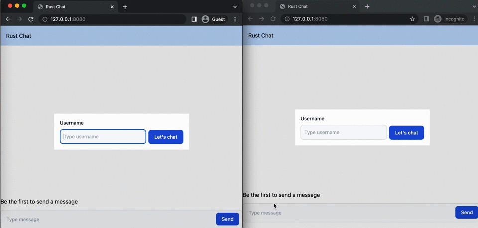

## Overall
Project is using cargo workspace to be able to share some types between front-end and back-end.  
The user is stored in session.

## Front-end
Yew, TailwindCSS, yew_websocket

## Back-end
Actix-web for HTTP and websocket, websocket is using Actix to handle connection in a role-oriented programming way.

## How to start  
run: make run-api  
run: make run-web  

